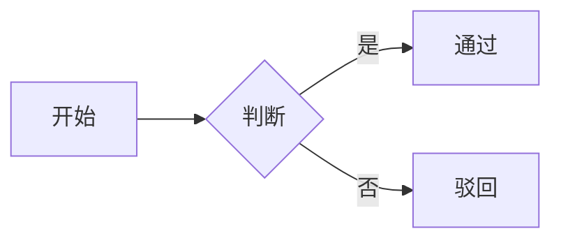

# 基础元素

CodeWF.Markdown 是基于 Avalonia 的 **Markdown 渲染库**：块级增量渲染、18 套排版主题、TextMate 代码高亮，完整包提供图片、公式、Mermaid 与导出能力。本演示覆盖全部基础元素。

## 文本与引用

支持 **加粗**、*斜体*、~~删除线~~、`行内代码` 与 [超链接](https://github.com/dotnet9/CodeWF.Markdown)。

> 引用块：渲染库内置 18 套排版主题，跟随明暗变体自动切换，可通过 **MarkdownTypographyThemeRegistry** 注册自定义主题。
>
> **[跳到代码示例](#代码高亮)**，也可以点入引用块编辑文字。

## 任务列表

- [x] 块级增量渲染（ContentHash 差分）
- [x] 代码高亮（TextMate 语法）
- [ ] 数学公式渲染（完整包）
- [ ] Mermaid 图表（完整包）

## 表格

| 能力 | 说明 | 状态 |
| --- | --- | --- |
| 增量渲染 | 仅替换变化块，滚动位置保持 | 已内置 |
| 代码高亮 | TextMate 语法定义，明暗双色 | 完整包 |
| Mermaid | 纯 .NET 渲染，无浏览器依赖 | 完整包 |

## 代码高亮

```csharp
public class Greeter
{
    private readonly string _name;
    public Greeter(string name) => _name = name;
    public string SayHello() => $"Hello, {_name}!";
}
```

## Mermaid 图表



## 数学公式

$$
\int_0^\infty e^{-x^2}\,dx = \frac{\sqrt{\pi}}{2}
$$

## 图片


## 列表与换行

1. 点入标题、段落或引用块编辑。
2. 按 Enter 新建下一块，按 Shift+Enter 插入块内换行。
3. 编辑表格单元格，或用右键菜单增删行列。

- 普通列表
  - 嵌套列表中的 **粗体** 与 [链接](https://codewf.com)

第一行后有硬换行。\
这一行仍属于同一段落。
